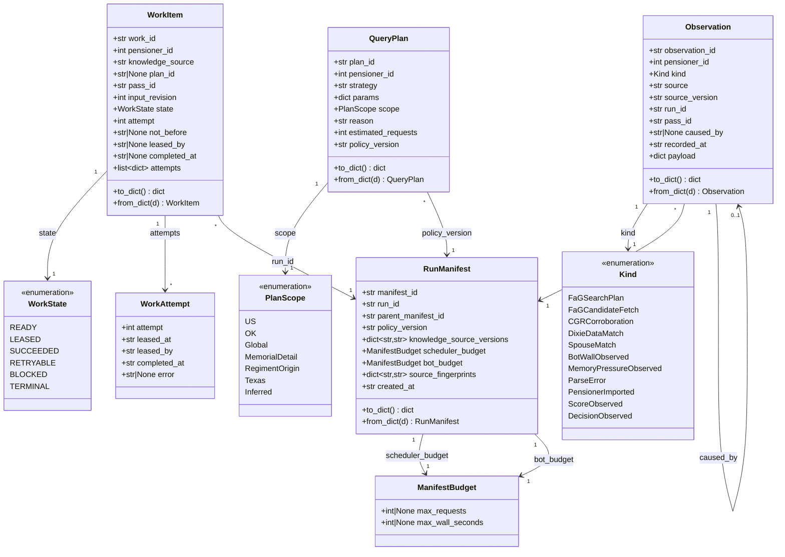
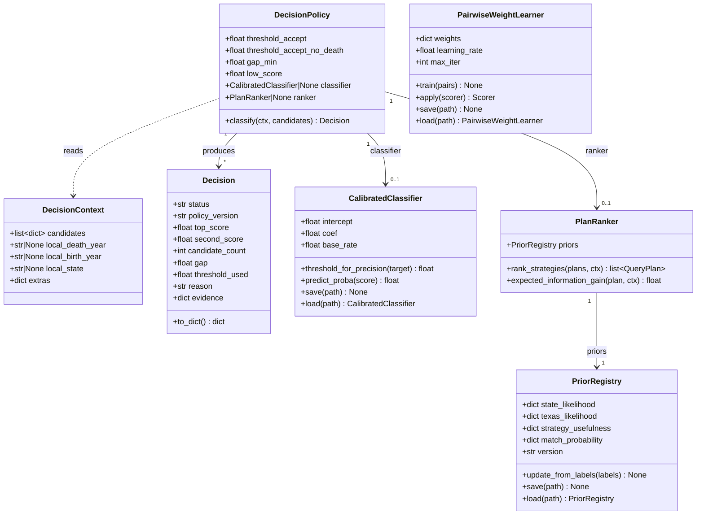
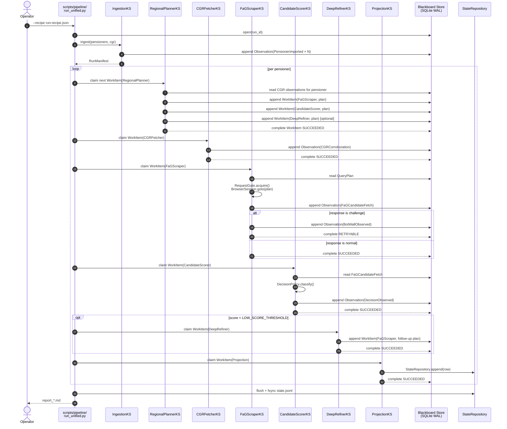
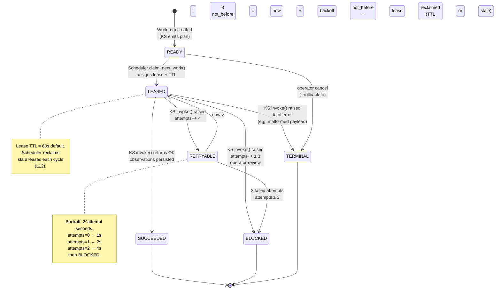

# Diagrams — Blackboard Data Model + Flows

> **Tier:** 1 (load when designing a new Knowledge Source,
> reading the schema, or wiring a new flow). Token cost: ~3K.
>
> Companion to [`blackboard-architecture.md`](blackboard-architecture.md).
> That doc explains *why*; this one shows *what* — the
> versioned data model, the per-pensioner flow, the self-
> learning loop, and the WorkItem lifecycle.

Renders inline on GitHub (issues, PRs, README). All four
diagrams are Mermaid.

---

## 1. Class diagram — Blackboard data model



All envelopes carry `schema_version` (currently `1`) so a
replay can deserialize an older shape through the right
`from_dict`. The dataclasses are plain (no pydantic) — the
`to_dict()` / `from_dict()` pair owns the wire format.

---

## 2. Class diagram — Decision policy + calibration + ranking



`Decision` carries `policy_version` so a replay recovers the
exact rule that produced the verdict. The
`CalibratedClassifier` is a single-feature logistic regression
(Platt scaling); not a deep model. The `PlanRanker` is
**advisory** — never overrides safety gates (cooldown, budget,
dedup). The `PairwiseWeightLearner` is the offline corrector;
the `CalibratedClassifier` is the online threshold-setter.

---

## 3. Sequence diagram — per-pensioner flow



Notes:

- Steps are **parallelizable**: RegionalPlanner / CGRFetcher /
  FaGScraper emit independent work items; the Scheduler runs
  them in whatever order respects the budget.
- Steps **6b** (FaGScraper detect challenge) and **9**
  (DeepRefiner follow-up) are conditional; the rest always
  fire for a given pensioner.
- The store is the single coordination point — KSs never call
  each other directly.

---

## 4. Sequence diagram — self-learning loop

```mermaid
sequenceDiagram
    autonumber
    actor Op as Operator
    participant V2 as scripts/view/v2.html<br/>(browser)
    participant Side as decisions_&lt;run&gt;.json
    participant Train as scripts/learning/<br/>train.py
    participant Lbl as LabelExtractor
    participant Pri as PriorRegistry
    participant Cls as CalibratedClassifier
    participant WL as PairwiseWeightLearner
    participant Eval as EvaluationHarness
    participant NextRun as scripts/pipeline/<br/>run_unified.py

    Op->>V2: review + pick / no-match / needs-research
    V2->>Side: "Save decisions" button
    Op->>Train: --labels sidecar.json

    Train->>Lbl: from_decisions_file(sidecar)
    Lbl->>Lbl: LabelSnapshot per pensioner
    Lbl->>Lbl: temporal split<br/>(train = pre-policy-N, eval = post)
    Lbl-->>Train: (train_labels, eval_labels)

    Train->>Pri: update_from_labels(train_labels)
    Pri->>Pri: refresh state_likelihood<br/>texas_likelihood<br/>strategy_usefulness
    Pri->>Pri: write priors_v2.json

    Train->>Cls: train(train_labels)
    Cls->>Cls: fit Platt scaling
    Cls->>Cls: write classifier_v2.json

    Train->>WL: train(train_labels)
    WL->>WL: fit pairwise logreg on<br/>(picked, rejected) deltas
    WL->>WL: write weights_v2.json

    Train->>Eval: holdout_eval(eval_labels, Cls, Pri)
    Eval-->>Train: precision/recall report

    Op->>NextRun: --recipe + --priors priors_v2.json<br/>+ --classifier classifier_v2.json

    NextRun->>Pri: load(priors_v2.json)
    NextRun->>Cls: load(classifier_v2.json)
    Note over NextRun: PlanRanker reorders strategies<br/>DecisionPolicy uses calibrated threshold
    NextRun->>NextRun: per-pensioner flow (see §3)
```

The loop is **advisory** — the PlanRanker ranks plans but
never overrides the scheduler's hard constraints (cooldown,
budget, dedup). The CalibratedClassifier only swaps in when
the operator supplies `--classifier`; the fallback is the
canonical hardcoded threshold from
`scripts/pipeline/scoring_constants.py` (L9).

The `EvaluationHarness` is the gate: if the held-out
precision drops below the prior, the new priors are kept on
disk but not auto-loaded; the operator decides whether to
promote them.

---

## 5. State diagram — WorkItem lifecycle



The two non-obvious transitions:

- **RETRYABLE → LEASED** (not → READY): the WorkItem retains
  its lease history (`attempts` list). Re-leasing from
  RETRYABLE rather than READY is what makes the retry
  budget enforceable — going back to READY would lose the
  attempt count.
- **READY → TERMINAL** (operator cancel): the `--rollback-to`
  flag moves WorkItems to TERMINAL when an operator rolls
  back to a checkpoint; they don't re-fire.

`BLOCKED` is intentionally terminal — the operator reviews
and either re-queues (manual edit to `READY`) or accepts the
data loss.

---

## Where to read more

- [`blackboard-architecture.md`](blackboard-architecture.md) —
  the *why* + module map for every dataclass shown here
- [`search-abstraction.md`](search-abstraction.md) §"Engine-
  agnostic common shape" — the `CommonCandidate` projection
- [`cross-layer-contract.md`](cross-layer-contract.md) —
  the `state.jsonl` shape ProjectionKS writes
- `scripts/blackboard/schema.py` — the canonical class
  definitions (any drift from these diagrams is a bug)
- `scripts/blackboard/scheduler.py` — the lease + retry
  implementation
- `scripts/learning/train.py` — the self-learning CLI