# Pipeline architecture — functional diagram

> **Status:** working sketch. Mermaid renders inline on GitHub
> (issues, PRs, README) without any plugin. ASCII version below
> for terminal / log-tail viewing.
>
> **Last major update:** 2026-07-20. Reflects the abstraction
> refactor (issues #33–#36): `SearchContext` + `Strategy` Protocol
> + `SearchEngine` Protocol + `SearchRecord`. FaG and Newspapers.com
> are both real `SearchEngine` implementations; the pipeline is
> engine-agnostic.

## What this pipeline does

For every record in the input (today: 7,709 OK Confederate
pensioners from `ok_pensioners.json`), find a matching
memorial / record in **whatever search engine the run is
configured to use**. Today that's `FaGEngine` (Find a Grave);
a 2nd engine `NewspapersComEngine` (Newspapers.com) was added
in #36 as a proof the abstraction is real.

The flow per record:

1. **Build a `SearchContext`** from the `SearchRecord`. Carries
   the pensioner name, year span, state, and any domain-specific
   extras (regiment, spouse name, etc.).
2. **CGR blocking** — fast local lookup of likely-named
   Confederate graves in OK cemeteries. The Confederate Graves
   Registry was scraped in bulk; 2,593 vets across 768
   cemeteries. (Opt-in; OK-specific.)
3. **Engine search** — `run_ladder()` iterates the engine's
   strategy list, builds a URL per strategy, navigates the
   Playwright page, parses results, scores, merges. The engine
   decides everything engine-specific (URL shape, parser,
   scoring, anti-bot, throttle).
4. **Both-match** — when the same person shows up in both CGR
   and engine results, the pipeline flags it for human review.

A reviewer opens `output/<runname>/view.html` in a browser and
disambiguates ambiguous results.

---

## The abstraction layers

```
   records (input)
        │
        ▼
   ┌──────────────────┐    ┌──────────────────┐
   │   SearchRecord   │    │   SearchContext  │  (per-search input)
   │  id, name, yrs,  │ →  │  first/middle/    │
   │  state, extras   │    │  last, birth/death│
   └──────────────────┘    │  year, state,     │
                            │  extras           │
                            └────────┬─────────┘
                                     │ (ladder iterates)
                            ┌────────▼─────────┐
                            │     Strategy     │  (URL params)
                            │  "given ctx,     │
                            │   build params"  │
                            └────────┬─────────┘
                                     │ dict of params
                            ┌────────▼─────────┐
                            │   SearchEngine    │  (HTTP + parse)
                            │  build URL, fetch,│
                            │  parse, score,    │
                            │  merge, classify  │
                            └────────┬─────────┘
                                     │ candidates
                            ┌────────▼─────────┐
                            │   Pipeline       │  (orchestrator)
                            │  CGR + engine +  │
                            │  both-match      │
                            └────────┬─────────┘
                                     │
                                     ▼
                              state.jsonl
```

Each layer is independent: a new strategy changes only the
Strategy layer; a new engine changes only the Engine layer; a
new record source (CSV, family tree, ...) changes only the
Record layer.

---

## Functional blocks (Mermaid — renders in GitHub)

```mermaid
flowchart TB
    %% ============ DATA SOURCES ============
    subgraph SRC[DATA SOURCES]
        OP[("docs/research/digitalprairie/<br/>ok_pensioners.json<br/>7,709 rows<br/>1900-1930 OK Confederate vets")]
        CGR[("docs/research/cgr/<br/>ok_vets_enriched.jsonl<br/>2,593 vets<br/>across 768 cemeteries")]
        PCARD[("docs/research/digitalprairie/<br/>ok_pensioners.pensioncard_pages.json<br/>(sidecar: pensioner_id -> IIIF page_ids)")]
    end

    %% ============ INGEST ============
    subgraph INGEST[INGEST - one-time per dataset]
        SCRAPE["scripts/ingest/<br/>scrape_digitalprairie.py<br/>+ normalize + OK-name rename<br/>-> ok_pensioners.json"]
        FETCH["scripts/ingest/<br/>fetch_pensioncard_pages.py<br/>digitalprairie API -> page_ids<br/>-> sidecar"]
        CGRSCRAPE["scripts/ingest/<br/>cgr_ok_scraper.py + cgr_enrich.py<br/>bulk scrape cgr.okhistory.org<br/>-> ok_vets_enriched.jsonl"]
    end

    %% ============ ABSTRACTION LAYERS ============
    subgraph ABSTR[ABSTRACTION LAYERS - scripts/search/]
        REC["SearchRecord<br/>scripts/search/record.py<br/>domain-agnostic input"]
        CTX["SearchContext<br/>scripts/search/context.py<br/>per-search input"]
        STRAT["Strategy<br/>scripts/search/strategy.py<br/>+ templates (DSL)"]
        LADDER["run_ladder()<br/>scripts/search/ladder.py<br/>mode='first' | 'all'"]
        ENGINE["SearchEngine Protocol<br/>scripts/search/engine.py<br/>6 building blocks"]
    end

    %% ============ ENGINE IMPLEMENTATIONS ============
    subgraph ENGINES[ENGINE IMPLEMENTATIONS - one per backend]
        FAGENG["FaGEngine<br/>scripts/search/fag_engine.py<br/>(1st engine, since 2026-07)"]
        NPENG["NewspapersComEngine<br/>scripts/search/newspapers_engine.py<br/>(2nd engine, proof of abstraction)"]
    end

    %% ============ PIPELINE ============
    subgraph PIPE[PER-RECORD PIPELINE - scripts/pipeline/]
        RUN["run_one(record, cgr, engine)<br/>scripts/pipeline/core.py"]
        BLOCK["CGR blocking lookup<br/>phonetic index over 2,593 vets<br/>scripts/matching/blocking.py"]
        ANNOT["annotate_cgr_matches<br/>scripts/cgr/cgr_matcher.py"]
        BOTH["detect_both_match<br/>scripts/matching/both_match.py"]
    end

    %% ============ FaG STRATEGY LADDER ============
    subgraph FAGLAD[FaG LADDER - 12 strategies]
        B1["B1-exact: last+first+exactspelling"]
        B2["B2-middle-initial"]
        B3["B3-first-initial-fuzzy"]
        B4["B4-fuzzy-last"]
        B5["B5-apostrophe-variants"]
        C1["C1-cw-context (Confederate bio)"]
        F1A["F1a-birthyear-exact"]
        F1B["F1b-deathyear (window 5 or 10)"]
        F1C["F1c-year-sniper (both years)"]
        F1D["F1d-year-window"]
        F2["F2-regiment-bio"]
        F3["F3-nickname"]
    end

    %% ============ Newspapers.com LADDER ============
    subgraph NPLAD[Newspapers.com LADDER - 3 strategies]
        N1["N1-keyword (name + year window)"]
        N2["N2-lastname-only"]
        N3["N3-with-state (last + state abbr)"]
    end

    %% ============ EXTERNAL ============
    FAGSITE(["findagrave.com<br/>Cloudflare + Turnstile<br/>throttle 2.5s default"])
    NPSITE(["newspapers.com<br/>Cloudflare + paywall<br/>throttle 1.0s default"])
    DPCI(["digitalprairie.ok.gov<br/>JSON API (IIIF images)"])

    %% ============ OUTPUTS ============
    RES[("output/test-batch-25/<br/>results.jsonl<br/>(per-record with all candidates)")]
    OUT[("output/test-batch-25/<br/>outliers.jsonl<br/>(low-score -> follow-up)")]
    VIEW["scripts/view.html<br/>copied to output/<runname>/view.html<br/>+ embedded results.jsonl"]
    DEDUP["scripts/cgr/cgr_fag_dedup.py<br/>post-run: cross-checks CGR<br/>against final picks"]
    REPORT["scripts/state/report_generator.py<br/>report_*.md + report_*.json"]
    RESUME["resume.sh<br/>(J5-S3) re-invokes with --config"]

    %% ============ HUMAN ============
    HUMAN(["REVIEWER (you)<br/>opens view.html<br/>picks, adds notes,<br/>decides 'no match' or 'follow up'"])
    EXP["view.html -> 'Export decisions' -> JSON<br/>(J10: self-contained, re-loadable)"]

    %% ============ WIRING ============
    OP --> SCRAPE
    SCRAPE -->|"now committed"| OP
    CGR --> CGRSCRAPE
    CGRSCRAPE -->|"now committed"| CGR
    SCRAPE -->|"once"| FETCH --> PCARD

    %% Records flow through the abstraction
    OP --> REC
    REC -->|"to_context()"| CTX
    CTX --> STRAT
    STRAT --> LADDER
    LADDER --> ENGINE
    ENGINE -.->|"1st impl"| FAGENG
    ENGINE -.->|"2nd impl"| NPENG

    %% Engines plug into the pipeline
    FAGENG --> RUN
    NPENG --> RUN
    OP --> RUN
    CGR --> RUN
    PCARD -->|"J6: view.html embeds IIIF"| RUN

    RUN --> BLOCK --> ANNOT
    RUN --> ENGINE
    ANNOT --> BOTH
    ENGINE --> BOTH

    %% FaG ladder
    FAGENG --> B1 & B2 & B3 & B4 & B5 & C1 & F1A & F1B & F1C & F1D & F2 & F3
    B1 & B2 & B3 & B4 & B5 & C1 & F1A & F1B & F1C & F1D & F2 & F3 -->|"page.goto per strategy"| FAGSITE
    FAGSITE -->|"HTML"| FAGENG
    FAGENG --> FAGENG_BUILD["build_url / parse_results_page<br/>score / classify / apply_filters<br/>(the 6 building blocks)"]

    %% Newspapers.com ladder
    NPENG --> N1 & N2 & N3
    N1 & N2 & N3 -->|"page.goto per strategy"| NPSITE
    NPSITE -->|"HTML"| NPENG
    NPENG --> NPENG_BUILD["build_url / parse_results_page<br/>score / classify / apply_filters"]

    RUN -->|"one record per pensioner"| RES
    RUN -->|"if best_score < 0.40"| OUT
    RES -->|"J9: embedded JSONL"| VIEW
    OUT -->|"read by follower scripts"| DEDUP
    RES --> DEDUP

    VIEW --> HUMAN
    HUMAN -->|"picks/notes/export"| EXP

    RUN -->|"on completion"| REPORT
    RUN -->|"on completion"| RESUME

    VIEW -.->|"'View source' modal"| DPCI

    classDef ext fill:#ffe,stroke:#996
    classDef store fill:#eef,stroke:#669
    classDef human fill:#fee,stroke:#966
    classDef abstr fill:#efe,stroke:#696
    class FAGSITE,NPSITE,DPCI ext
    class OP,CGR,PCARD,RES,OUT,RESUME,EXP,REPORT store
    class HUMAN human
    class REC,CTX,STRAT,LADDER,ENGINE,FAGENG,NPENG abstr
```



## ASCII version (for tail / terminal / copy-paste)

```
                 DATA SOURCES              INGEST (one-time)
                 .---------.                .-------------.
                 | ok_pen- |---> scrape -->| ok_pensioners|
                 | sioners  |              |   .json      |
                 | 7,709    |              `------+------'
                 `---------'                     |
                                                | fetch
                                                v
                                         .-----------.
                                         |pensioncard |
                                         |pages sidecar|
                                         `-----.-----'
                                               |
                                               v
   .--------------------------.    .----------------------------.
   | ABSTRACTION LAYERS       |    | PIPELINE                   |
   | scripts/search/          |    | scripts/pipeline/          |
   |  .-----------.           |    |  .--------------------.    |
   |  |SearchRecord|<--.      |    |  | run_one(           |    |
   |  `-----------'   |      |    |  |   record, cgr,    |    |
   |                  | to_  |    |  |   engine)          |    |
   |  .-----------.   | ctx  |    |  `--------+-----------'    |
   |  |SearchContx|<--'      |    |           |                |
   |  `-----------'          |    |  +--------+----------+    |
   |        |                |    |  |  CGR  |  ENGINE  |    |
   |  .-----------.          |    |  |block  | (FaG or  |    |
   |  | Strategy  |          |    |  |       |  Papers) |    |
   |  | (fn or   |          |    |  `------------------'    |
   |  | template)|          |    |           |                |
   |  `-----------'          |    |           v                |
   |        |                |    |     .----------.          |
   |  .-----------.          |    |     |results.  |--> view  |
   |  | run_ladder|<-----.   |    |     |jsonl     |    .html |
   |  `-----------'      |   |    |     `----------'    `-----'
   |                     |   |    |           |          |
   |  .----------------. |   |    |           v          v
   |  |SearchEngine    |-'   |    |     outliers  REVIEWER
   |  |  Protocol     |     |    |     .jsonl    (browser)
   |  `----------------'     |    |                 picks/
   |        |                |    |                 notes/
   |  +-----+-----+         |    |                 export
   |  |     |     |         |    |
   |  v     v     v         |    |     post-run dedup
   | FaG  Papers  Your?     |    |     scripts/cgr/
   | Engine Engine  (next)  |    |     cgr_fag_dedup.py
   |                       |    |
   `-----------------------'    `----.----------------------'
                                     | on completion
                                     v
                                .----------.
                                | report_* | + resume.sh
                                `----------'

THROTTLE + SAFETY (L1):
  FaGEngine: 2.5s default (configurable; floor 1.0s).
  NewspapersComEngine: 1.0s (lenient; Cloudflare less aggressive).
  Playwright session reset every 250 records to bound
  Chromium RSS growth (memory-leak fix).

  State IO: f.flush() + os.fsync() per pensioner (L3).
  Resume: state.jsonl read at start; done IDs skipped.
```

---

## What this diagram is trying to surface

1. **Three concentric abstraction layers** in `scripts/search/`:
   `SearchRecord` (input) → `SearchContext` (per-search) →
   `Strategy` (URL params) → `SearchEngine` (HTTP + parse).
   Each layer is independently extensible. New record source?
   Add a `from_<source>` builder. New strategy? Write a function
   or a template. New engine? Implement the 6-block Protocol.

2. **Two engines today**: `FaGEngine` (the worked example for
   a hostile backend with Cloudflare + paywall + state filter)
   and `NewspapersComEngine` (the 2nd engine, added in #36 to
   prove the abstraction). The pipeline consumes either
   unchanged via `config.engine = ...`.

3. **Two parallel ingest paths** (digitalprairie + CGR) produce
   the input files. These run **once** and the output is
   committed.

4. **Per-record pipeline** is a single function (`run_one`)
   with three phases: CGR blocking → engine search → both-match
   detection. CGR is **opt-in** and **never gates** the engine
   search (POLICY-LOCKED 2026-07-16).

5. **Engine search** is the slow part: per-strategy page
   navigations, throttled. The strategy ladder lives in
   `engine.ladder` (per engine; FaG has 12, Newspapers.com
   has 3).

6. **Outputs** are multiple JSONL files: per-record results,
   outliers (follow-up candidates), per-run reports. Each run
   writes to its own `output/<runname>/` directory.

7. **`view.html` is the review layer** — the pipeline's output
   is the *input* to the browser-based reviewer. Picks/notes
   get written back via the "Export" button.

8. **Post-run CGR <-> engine dedup** (J7) cross-checks CGR-side
   matches against final engine picks, annotating each
   record with `cgr_dedup_status`.

---

## How the abstractions compose

The pipeline's `run_one()` function is the seam. A future
contributor reads that function and the abstraction doc
(`docs/agents/search-abstraction.md`) and can answer:

- "How do I add a new strategy?" → write a function or a
  template, append to the engine's ladder.
- "How do I add a new engine?" → implement the 6 `SearchEngine`
  building blocks. The Newspapers.com engine is the worked
  example.
- "How do I add a new record source?" → add a
  `from_<source>(...)` constructor in `record.py`.

The pipeline never changes. The state schema never changes
(it's the engine-agnostic dict; the engine's result lands
in `attributes`). The view.html review UI is the only
per-engine place that needs adaptation, and even that is
in the "future work" column for Newspapers.com.

---

## Where to read more

- `docs/agents/search-abstraction.md` — how to add strategies
  and engines, with worked examples.
- `scripts/search/` — the abstraction modules (record, context,
  strategy, ladder, engine, template).
- `scripts/search/fag_engine.py` — FaGEngine (1st engine).
- `scripts/search/newspapers_engine.py` — NewspapersComEngine
  (2nd engine, proof of abstraction).
- `scripts/pipeline/core.py` — `run_one()` is the seam.
