# Pipeline architecture — functional diagram

> **Status:** working sketch. Mermaid renders inline on GitHub
> (issues, PRs, README) without any plugin. ASCII version below
> for terminal / log-tail viewing.

## What this pipeline does

For every pensioner in `ok_pensioners.json` (a slice of the OK
Confederate pension roll), find the matching Find a Grave
memorial **if it exists**, by combining:

1. **CGR blocking** — fast local lookup of likely-named Confederate
   graves in OK cemeteries (the Confederate Graves Registry was
   scraped in bulk; 2,593 vets across 768 cemeteries).
2. **FaG search** — Playwright-driven, throttle-aware, strategy-
   laddered search against findagrave.com.
3. **Both-match** — when the same person shows up in both sources,
   the pipeline flags it for human review.

A reviewer (you) opens `output/<runname>/view.html` in a browser
and disambiguates the ambiguous results.

---

## Functional blocks (Mermaid — renders in GitHub)

```mermaid
flowchart TB
    %% ============ DATA SOURCES ============
    subgraph SRC[DATA SOURCES]
        OP[("docs/research/digitalprairie/<br/>ok_pensioners.json<br/>7,709 rows<br/>1900-1930 OK Confederate vets")]
        CGR[("docs/research/cgr/<br/>ok_vets_enriched.jsonl<br/>2,593 vets<br/>across 768 cemeteries")]
        PCARD[("docs/research/digitalprairie/<br/>ok_pensioners.pensioncard_pages.json<br/>(sidecar: pensioner_id -> IIIF page_ids)")]
    end

    %% ============ INGEST ============
    subgraph INGEST[INGEST - one-time per dataset]
        SCRAPE["scripts/ingest/<br/>scrape_digitalprairie.py<br/>+ normalize + OK-name rename<br/>-> ok_pensioners.json"]
        FETCH["scripts/ingest/<br/>fetch_pensioncard_pages.py<br/>digitalprairie API -> page_ids<br/>-> sidecar"]
        CGRSCRAPE["scripts/ingest/<br/>cgr_ok_scraper.py + cgr_enrich.py<br/>bulk scrape cgr.okhistory.org<br/>-> ok_vets_enriched.jsonl"]
    end

    %% ============ PIPELINE ============
    subgraph PIPE[PER-PENSIONER PIPELINE - scripts/pipeline/]
        BATCH["run_batch()<br/>+ ResumeTracker<br/>(skip already-done ids)"]
        CORE["run_pipeline_for_pensioner()<br/>in core.py"]
        BLOCK["CGR blocking lookup<br/>phonetic index over 2,593 vets<br/>scripts/matching/blocking.py"]
        ANNOT["annotate_cgr_matches<br/>scripts/cgr/cgr_matcher.py"]
        FAG["search_one_pensioner()<br/>scripts/fag/search.py<br/>~10 strategies in ladder"]
        BOTH["detect_both_match<br/>scripts/matching/both_match.py"]
    end

    %% ============ FaG STRATEGY LADDER ============
    subgraph LADDER[FaG STRATEGY LADDER - scripts/search/strategies.py]
        S1["B1-exact: last+first<br/>+death if known"]
        S2["B2-loose: last+first<br/>+birth+death range"]
        S3["B3-with-middle"]
        S4["B4-loose-no-dates"]
        S5["F1-by-regiment-keyword<br/>nickname variants"]
        S6["F2-regiment-bio (regiment+death+state)"]
        S7["F3-nickname (alias table)"]
        S8["F4-spouse-cross"]
    end

    %% ============ FaG INTERNALS ============
    subgraph FAGINT[FaG INTERNALS]
        BROWSER["scripts/fag/fag_browser.py<br/>+ pw_session.py<br/>Playwright + stealth<br/>warmup + reset every 250"]
        PARSE["scripts/fag/parser.py<br/>parse_results_page()"]
        SCORE["scripts/fag/scoring.py<br/>score_candidate + tag_candidates_with_found_by"]
        FILTER["scripts/fag/filters.py<br/>apply_location_filter (OK / state_38)"]
        STATEIO["scripts/fag/state_io.py<br/>checkpoint + resume-tracker"]
    end

    %% ============ EXTERNAL ============
    FAGSITE(["findagrave.com<br/>Cloudflare + Turnstile<br/>throttle 2.5s default"])
    DPCI(["digitalprairie.ok.gov<br/>JSON API (IIIF images)"])

    %% ============ OUTPUTS ============
    RES[("output/test-batch-25/<br/>results.jsonl<br/>(per-pensioner with all candidates)")]
    OUT[("output/test-batch-25/<br/>outliers.jsonl<br/>(low-score -> follow-up)")]
    VIEW["scripts/view.html<br/>copied to output/<runname>/view.html<br/>+ embedded results.jsonl"]
    DEDUP["scripts/cgr/cgr_fag_dedup.py<br/>post-run: cross-checks CGR<br/>against final FaG picks"]
    REPORT["scripts/state/report_generator.py<br/>report_*.md + report_*.json"]
    RESUME["resume.sh<br/>(J5-S3) re-invokes with --config"]

    %% ============ HUMAN ============
    HUMAN(["REVIEWER (you)<br/>opens view.html<br/>picks, adds notes,<br/>decides 'no match' or 'follow up'"])
    EXP["view.html -> 'Export decisions' -> JSON<br/>(J10: self-contained, re-loadable)"]

    %% ============ WIRING ============
    OP --> SCRAPE
    SCRAPE -->|"now committed"| OP
    CGR --> CGRSCRAPE
    CGRSCRAPE -->|"now committed"| CGR
    SCRAPE -->|"once"| FETCH --> PCARD

    OP --> BATCH
    CGR --> BATCH
    PCARD -->|"J6: view.html embeds IIIF"| BATCH

    BATCH -->|"per pensioner"| CORE
    BATCH -->|"copy+embed (J5-S2, J9)"| VIEW
    BATCH -->|"on completion"| REPORT
    BATCH -->|"on completion"| RESUME

    CORE --> BLOCK --> ANNOT
    CORE --> FAG
    ANNOT --> BOTH
    FAG --> BOTH

    FAG --> FILTER -->|"throttled"| BROWSER
    FAG --> S1 & S2 & S3 & S4 & S5 & S6 & S7 & S8
    S1 & S2 & S3 & S4 & S5 & S6 & S7 & S8 -->|"page.goto per strategy"| BROWSER
    BROWSER -->|"page.goto"| FAGSITE
    FAGSITE -->|"HTML"| PARSE
    PARSE --> SCORE
    SCORE --> MERGE(["merge_candidates<br/>(union across strategies)"])
    MERGE --> CORE
    BROWSER -.->|"state_io checkpoint"| STATEIO

    CORE -->|"one record per pensioner"| RES
    CORE -->|"if best_score < 0.40"| OUT

    BROWSER -->|"secondary fetch<br/>(view.html 'View source' modal)"| DPCI

    RES -->|"J9: embedded JSONL"| VIEW
    OUT -->|"read by follower scripts"| DEDUP
    RES --> DEDUP

    VIEW --> HUMAN
    HUMAN -->|"picks/notes/export"| EXP

    classDef ext fill:#ffe,stroke:#996
    classDef store fill:#eef,stroke:#669
    classDef human fill:#fee,stroke:#966
    class FAGSITE,DPCI ext
    class OP,CGR,PCARD,RES,OUT,RESUME,EXP,REPORT store
    class HUMAN human
```



## ASCII version (for tail / terminal / copy-paste)

```
                                                              .--------.
                                                              | CGR    |  (committed)
                                                              | 2,593  |
                                                              `--------'
                                                                  |
.--------.   .--------------.   .--------.       .--------------. |
| ok_    |---| ingest       |---|  --.   |       |              | |
| pen-   |   | (one-time)   |   |    \  |<--BGR--|   run_batch  | |
| sioners|   |              |   |  --'   |       |   +Resume   | |
| .json  |---|              |   | pipe-  |       |              | |
| 7,709  |   |              |   | line/  |       |              | |
| rows   |   |              |   | core.py|       |              | |
`--------'   `------+-------+   `---+----'       `--+-----+-----' |
                      |             |                 |     |       |
                      v             v                 |     v
                .-----------.   .---------.           |  COPY+EMBED
                | pensioncard|  | run_    |          |  view.html
                | pages      |  | batch   |          |  <-- results.jsonl
                | sidecar    |  |  ...    |          |
                `-----.-----'   `----+----'           v
                      |               |         .-----------.
                      |               |         |  scripts/ |
                      |               +-------->|  view.html|
                      v                         | + embedded|
                .-----------.                   | results   |
                | fetch_    |                   `-----+-----'
                | pension   |                         |
                | card_     |                         v
                | pages.py  |                   .-----------.
                `--|----+---'                   | REVIEWER  |
                   |    |                       | opens     |
                   v    v                       | view.html |
              .-----------.                     | in        |
              | digital-  |<----FETCH--------+ | browser   |
              | prairie   |      (page_ids)  | |           |
              | IIIF API  |                   `------+----'
              `-----------'                          |
                                                    v
.---------------------------------.             .------------.
| per-pensioner (core.py loop)    |             | EXPORT     |
+---------------------------------+             | decisions  |
| 1) CGR blocking (fast, local)   |             | JSON (J10) |
|      phonetic -> vet IDs        |             | self-cont- |
|      -> match_pensioner_to_cgr  |             | ained, can |
|      -> annotate_cgr_matches    |             | be re-     |
|                                 |             | loaded     |
| 2) FaG search (slow, throttled) |             `------------'
|      ladder of ~10 strategies:  |
|        B1..B4   name variants   |
|        F1..F4   bio/spouse      |
|      each:                     |
|        page.goto /memorial/... |
|        parse_results_page()     |
|        score_candidate()        |
|      merge + dedupe across     |
|      strategies (no early stop) |
|                                 |
| 3) both_match detection        |
|      same person in CGR+FaG?   |
|      -> BOTH_MATCH flag        |
+---------------------------------+
                  |
                  v
        .-----------------.
        | results.jsonl   |--> post-run
        | (per pensioner) |    scripts/cgr/
        | ranked_         |    cgr_fag_dedup.py
        | candidates[]    |
        `-----------------'

THROTTLE + SAFETY (L1):
  Default 2.5s between FaG requests (configurable via
  --throttle). Test batch 25 uses 1.5s. Lifting to 2.5s
  after live monitoring showed CF 1015 hits at 1.5s.

  Playwright session reset every 250 records to bound
  Chromium RSS growth (memory-leak fix).

  Warmup: visit FaG homepage once to prime the CF session.

  State IO: f.flush() + os.fsync() per pensioner (L3).
  Resume: state.jsonl read at start; done IDs skipped.
```

## What this diagram is trying to surface

1. **Two parallel ingest paths** (digitalprairie + CGR)
   that produce the input files. These run **once** and
   the output is committed to the repo.

2. **Per-pensioner pipeline** is a single function
   (`run_pipeline_for_pensioner`) with three phases:
   CGR blocking -> FaG strategy ladder -> both-match
   detection. FaG is **never gated** by CGR (POLICY-
   LOCKED 2026-07-16).

3. **FaG search** is the slow part: ~10 page navigations
   per pensioner, throttled. The strategy ladder lives in
   `scripts/search/strategies.py` and is a flat list of
   `(name, fn)` tuples iterated in order.

4. **Outputs** are multiple JSONL files: per-pensioner
   results, outliers (follow-up candidates), per-run
   reports. Each run writes to its own `output/<runname>/`
   directory.

5. **view.html is the review layer** — the pipeline's
   output is the *input* to the browser-based reviewer.
   Picks/notes get written back via the "Export" button.

6. **Post-run CGR <-> FaG dedup** (J7) cross-checks
   CGR-side matches against final FaG picks, annotating
   each record with `cgr_dedup_status`.

## Candidate issues (the ones you flagged — to be filed as issues)

The user wants to identify what's wrong. From reading the code, here are
the candidates that match the "couple of major issues" you mentioned:

### 1. **`FAG_STATE_IDS` table is duplicated AND both copies disagree with current FaG**

**SEVERITY: HIGH. Silent correctness bug.**

- `scripts/fag/search.py` (lines 142-152) defines `FAG_STATE_IDS`
  and the docstring says: *"enumerated from
  data/probe/page_html_baseline.html"*. **This table disagrees
  with the live baseline file** for ~28 states (e.g. `TN: state_44`
  but FaG's HTML shows Tennessee = `state_45`; `TX: state_45` but
  live is `state_46`).
- `scripts/fag/filters.py` (lines 21-32) ALSO defines
  `FAG_STATE_IDS` and `apply_location_filter()` uses THIS table.
  **This table disagrees with the live baseline file** for ~42
  states (e.g. `AL: state_1` but live is `state_3`).
- OK = `state_38` is correct in BOTH tables and matches the live
  baseline file. By coincidence the project hasn't tripped over
  this yet.
- Neither table is the single source of truth; they drifted apart
  at some point (probably when one of them was copy-pasted from
  the other + a hand-edit).
- **Why it matters**: when broadening `--fag-state-filter` to any
  state other than OK, FaG would return results scoped to the
  wrong region. For Texas specifically, the project would silently
  return Tennessee results (or whatever state is at `state_45`).
- **Why the baseline disagrees with itself**: FaG has been adding
  new location entries (continents went from 4 to 7, US territories
  came and went, etc.). The probe `data/probe/page_html_baseline.html`
  captures a single moment in time; FaG's IDs shift around as
  the location graph evolves. There is no automated refresh.
- **Fix**: 
  1. Extract `FAG_STATE_IDS` to a single source of truth module
     (e.g. `scripts/fag/location_ids.py`).
  2. Import from both `search.py` and `filters.py`.
  3. Add a regression test that fetches the current FaG browse
     page (or accepts a captured snapshot as input) and verifies
     every US state abbr maps to the correct `state_N` value.
  4. Add a periodic probe script that alerts when IDs drift.
  5. Lock in OK = `state_38` as a smoke test.

### 2. Strategy ladder has **no early stop** by design

- `scripts/fag/search.py:403` — `No early-stop — collect all
  candidates across all strategies`. So an obvious match like
  John Smith 1st Cavalry OK runs ALL B1..F4 (~10 navigations)
  even when B1 already returned the exact match.
- Cloudflare budget: 10x waste on obvious matches. At 1.5s throttle
  + 10 strategies that's 15s per obvious pensioner vs ~1.5s.
- **Fix**: break out of the strategy loop when
  `best_score >= auto_accept_threshold AND top-gap >= AUTO_ACCEPT_GAP
  AND visited_strategies >= min_strategies_for_confidence`.
- Cost: sometimes we miss a better candidate from a later strategy.
  Acceptable trade-off because the merge strategy already
  deduplicates by memorial_id.

### 3. CGR blocking index **rebuilt per pensioner in some paths**

- `scripts/pipeline/core.py:275` rebuilds the CGR blocking index
  UNLESS `prebuilt_cgr_index` is passed. `run_batch` does pass it,
  but `run_one_pensioner_cgr_only()` (and any test or external
  caller) silently rebuilds. For the full 7,709 run that's
  7,709 × (build + discard) = 7,709 garbage indices.
- Symptom: in long batch runs, RSS climbs by ~85 MB/min from the
  phonetic-index allocations.
- **Fix**: rename `prebuilt_cgr_index` to `cgr_index` (required),
  and add an assertion at the top of `run_pipeline_for_pensioner`
  that fails loud if the orchestrator forgot to pass it.

### 4. **Two result-status taxonomies**

- `scripts/fag/search.py` defines `S_AUTO_ACCEPT`, `S_AMBIGUOUS`,
  `S_TOO_MANY`, `S_CAPTCHA`, `S_SKIP`, `S_NO_RESULTS`, `S_ERROR`.
- `scripts/fag/filters.py` imports `S_NO_RESULTS`, `S_ERROR` and
  re-exports them. **Both modules define their own strings**.
- `scripts/view.html` hard-codes the same strings in display logic.
- A typo (`S_AUTOCEPT`) in any module would silently never match.
- **Fix**: single `scripts/fag/status.py` with a `Status` enum (or
  StrEnum) so type-checkers can find typos. Migrate view.html
  JavaScript to read from a server-generated lookup.

### 5. resume.sh writes with **`set -euo pipefail` + fragile `cd`**

- `scripts/pipeline/run_unified.py:166-167`: the relative `cd
  "$(dirname "$0")/../.."` assumes the resume.sh lives at
  `<repo>/output/<runname>/resume.sh`. If the user copies a
  run dir to another location, the next `bash resume.sh` will
  silently `cd` to the wrong place.
- **Fix**: write an absolute path (resolved at write time) into
  the script, or skip the `cd` and use a `--root-dir` flag.

### 6. **FaG throttle bypass**: throttle is a kwarg

- `search_one_pensioner(... throttle_seconds=None)`. The CLI
  defaults to 2.5, but the helper itself has no floor — `0.0` is
  legal.
- **Fix**: enforce a hard minimum (1.0s?) at the function level;
  raise `ValueError` if below the floor.

### 7. **IIIF sidecar freshness**: silent staleness

- `ok_pensioners.pensioncard_pages.json` is committed (J11
  reproduce commit), but if you edit `ok_pensioners.json` and
  forget to re-run `fetch_pensioncard_pages.py`, view.html shows
  the *old* images (or no images) for new pensioners. No
  automation detects "pensioner list newer than sidecar."
- **Fix**: in `run_batch`, log a warning when
  `mtime(ok_pensioners.json) > mtime(sidecar)`.

### 8. **Follow-up report never regenerates**

- `leftover_investigation.py` follow-up strategies produce new
  top-candidates but the final report only runs at end of primary
  batch.
- **Fix**: call `build_report` after follow-up completes, with a
  different report timestamp.

## Open questions

These match what we'd want to file as issues — to be triaged
together once you decide which of A-H are real.

1. Is there an end-to-end profiling trace that shows where time
   goes? (I'm guessing: 70% network, 20% parse, 5% score, 5% state IO
   — but I haven't measured.)

2. Is there a deterministic-dryrun mode? (Browser off, replay a
   stored FaG response, validate the pipeline on the same input as
   the real run, diff.) — would catch drift in `parser.py` /
   `scoring.py` between versions.

3. Are CGR ingest + digitalprairie ingest scheduled (cron /
   airflow) or are they always manual?

## Next step

Pick which of A-H you want filed as issues today. I'll cluster them
into:
- "Hot fixes" (correctness or risk)
- "Refactors" (tax on future work)
- "Investigations" (need measurement before acting)

and file them with the standard template (see
docs/agents/issues/feature-template.md).
